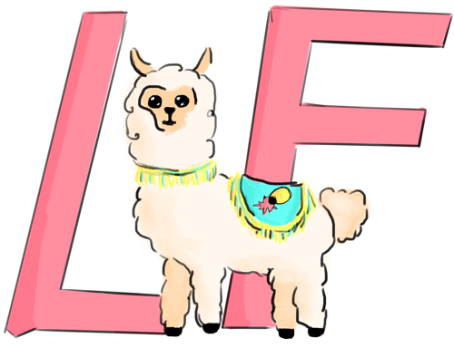

# llama-farm
Chat with multiple bots with different personalities, hosted locally
or with OpenAI, in the comfort of a beautiful 1970's terminal-themed
REPL.



### Example chat

> Ati:      Hi Olivia.
> Olivia:   Hello! How may I assist you today?
> Ati:      I'm just messing around with voices.
> Olivia:   That's interesting! What kind of voices would you like to explore?
> Ati:      Yours is a French female voice. Perhaps you could speak some French. Did you see how Bob expressed
>           emotions earlier?
> Olivia:   Oui, j'ai vu le message de Bob. Il était très excité et animé. Pour vous parler en français, je vais
>           essayer de faire une voix française féminine. Comment allez-vous aujourd'hui?
> Ati:      Pas mal.
> Olivia:   J'essaie de répondre de la manière la plus utile et la plus claire possible.
>           Si vous avez besoin d'aide, n'hésitez pas à me contacter.
> Ati:      /youtube xUezfuy8Qpc Traduisez ce texte en français.
> Olivia:   "Considérez les informations suivantes avant de répondre : La liberté d'expression est cruciale pour
>           notre société, mais ses limites ont besoin de clarification. Selon Rowan Atkinson, les restrictions sur
>           la liberté d'expression peuvent nuir aux minorités et limiter la pensée critique. Il fournit des
>           exemples de personnes arrêtées pour appeler un cheval de police homosexuel ou afficher des versets
>           bibliques sur un écran de télévision. Le projet de loi proposé pourrait criminaliser l'utilisation de
>           langage injurieux ou diffamatoire provoquant harcèlement, trouble ou détresse. Cependant, l'imprécision
>           des termes crée une incertitude quant à ce qui constitue un crime. Ceci pourrait conduire au silence
>           des critiques légitimes et de la dissidence. Même après avoir retiré leurs actions, cela peut entraîner
>           des conséquences juridiques, freinant le débat public et la participation. Ainsi, bien que certaines
>           formes de discours requièrent des restrictions, la proposition actuelle est trop large et floue,
>           potentiellement silencieux nécessaire dialogue et dissension."

### Topical chat memory
Llama-farm has a **long-term chat memory** that recalls previous
conversations. A summary of previous conversation relevant to the
topic (automatically determined) is available to the active bot.

### Knowledge database
Ask it questions about your own documents and information, stored in a
local vector knowledge store. I recommend you are selective about
what you ingest in order to improve the relevance of results. The
quality of information available is more important than the quantity.

### Internet access & summarization
You can ask it questions with access to arXiv or wikipedia.
It can summarize Youtube video transcripts, URLs and your files.

### Compatibility and technology
Llama-farm speaks to any OpenAI-compatible API:

- oobabooga/text-generation-webui (via its OpenAI-compatible API extension)
- OpenAI
- lm-sys/FastChat (untested)
- keldenl/gpt-llama.cpp (untested)

Llama-farm uses microsoft/guidance and hwchase17/langchain for some abstractions (see limitations).

The storage is backed by [faiss](https://github.com/facebookresearch/faiss). The wrapper to [chromadb](https://github.com/chroma-core/chroma) is
written but is not currently used or tested.

### Help text
The help text is [here](llama_farm/help.md).

### Setup
Copy the `config.toml.example` to `config.toml`.
To use openAI, you need to set your key in `config.toml`.

There are a lot of dependencies so it's recommended you install everything in a virtual environment.
Either clone the repo, install the `requirements.txt` and run the module
```
$ <activate your venv>
$ git clone https://github.com/atisharma/llama_farm
$ cd llama_farm
$ pip install -r requirements.txt
$ python -m llama_farm
```

Or, install using pip
```
$ <activate your venv>
$ pip install git+https://github.com/atisharma/llama_farm
$ llama-farm
```

### Suitable models
Llama-farm works very well with OpenAI's gpt-3.5-turbo.
Wizard-Vicuna-Uncensored, WizardLM, etc also work very well. It even
works surprisingly well with WizardLM-7B!  But see limitations below.

### Limitations and bugs
- Larger LLaMA models (30B) work much better.
- The context length limitation of Llama models (2048 tokens) is half or
less that of OpenAI's models.
- The OpenAI API (and compatible ones) do not expose a number of
  capabilities that local models have. The full power of the guidance
  library is therefore not available.

### Roadmap
- Replace LLMs with guides:
  * ask.xyz
  * models.reply (do first, easy)
- Reconsider store document size, since summarization works well
- Define tools for freeform memory access rather than /command syntax
- You can grep the codebase for "TODO:" tags; these will migrate to github issues
- Define JSON API templates for other web tools
- Self-chat between bots with intention/task injection
